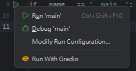

### GradioLauncher

<!-- Plugin description -->
Add a simple action to run python file with [gradio](https://github.com/gradio-app/gradio). You have to add gradio to
your project's environment path first (```uv add gradio``` or ```pip install gradio```).
<!-- Plugin description end -->


